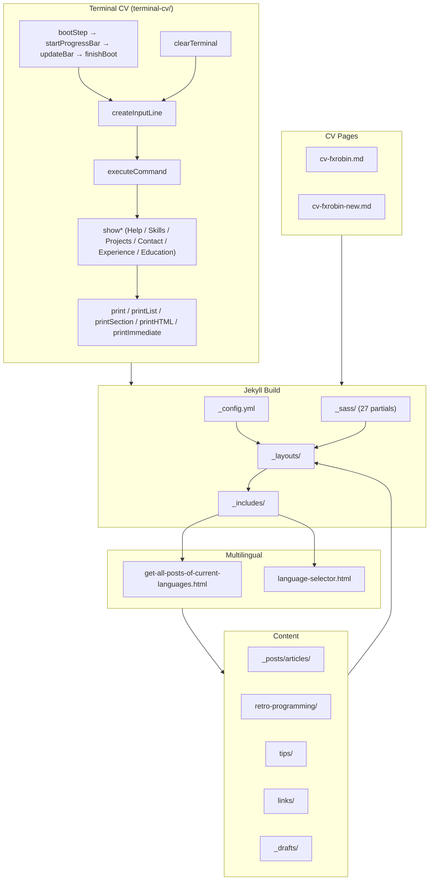

# Architecture — fxjavadevblog.fr

Personal tech blog at [https://www.fxjavadevblog.fr](https://www.fxjavadevblog.fr).  
Stack: **Jekyll** (static site generator) + **GitHub Pages** CI/CD.  
GitNexus index: 802 symbols · 889 relationships · 9 clusters · 14 execution flows.

---

## Functional Areas

### 1. Jekyll Core
| Path | Role |
|------|------|
| `_config.yml` | Site-wide config (baseurl, plugins, collections, multilingual defaults) |
| `_layouts/` | Page templates: `default`, `post`, `page`, `page-no-aside`, `blog_index`, `cv-layout`, `cv-new-layout` |
| `_includes/` | Reusable partials (sidebar, TOC, tags, categories, search, language selector, analytics) |
| `style.scss` | Entry point — imports all `_sass/` partials |

### 2. Multilingual System
Posts and pages carry a `lang:` front-matter key (`fr` / `en`).  
`_includes/get-all-posts-of-current-languages.html` filters the global post list by language.  
`_includes/language-selector.html` renders the FR/EN switcher.  
Paired pages share the same slug with a language suffix (e.g. `index-fr.md` / `index-en.md`).

### 3. Content Collections
| Path | Content type |
|------|-------------|
| `_posts/articles/` | Main blog articles (Java, Linux, APIs) |
| `retro-programming/` | Retro computing section with dedicated index |
| `tips/` | Short tips listing page |
| `links/` | Curated link collections (FR + EN) |
| `about.md` / `about-en.md` | Author bio pages |
| `_drafts/` | Work-in-progress posts |

### 4. Styling (SCSS)
27 partials under `_sass/`, compiled via `style.scss`.  
Key files: `_variables.scss`, `_mixins.scss`, `_base-rules.scss`, `_article.scss`, `_cards.scss`,  
`_highlights.scss` (code syntax), `_table-of-content.scss`, `_gurumeditation.scss` (easter egg).

### 5. Terminal CV (Interactive Widget)
Self-contained retro terminal at `terminal-cv/`.  
Pure JavaScript — no framework dependency.

| File | Role |
|------|------|
| `terminal-cv/terminal.js` | All terminal logic (boot, commands, rendering) |
| `terminal-cv/cv-data.js` | CV content data (experience, skills, education, projects, contact) |
| `terminal-cv/index.html` | Standalone terminal page |
| `terminal-cv/style.css` | Terminal-specific styles |

### 6. CV Pages
| File | Format |
|------|--------|
| `cv-fxrobin.md` | Markdown CV (print-friendly layout) |
| `cv-fxrobin-new.md` | Extended CV (new layout) |
| `style-cv.scss` / `style-cv-new.scss` | CV-specific print styles |

### 7. Assets & Embeds
`images/`, `fonts/`, `downloads/`, `js/`, `asciinema/`, `casts/` — static files served as-is.  
`_includes/asciinema.html`, `_includes/mermaid.html`, `_includes/video.html` — embed helpers.

---

## Key Execution Flows (Terminal CV)

All 14 flows live in `terminal-cv/terminal.js`.

### Boot Sequence
```
bootStep → startProgressBar → updateBar → finishBoot → createInputLine
```
Simulates a retro OS boot with animated progress bar, then drops into an interactive prompt.

### Command Dispatch
```
createInputLine → executeCommand → show* → printSection / printList / print
```
`executeCommand` routes user input to one of: `showHelp`, `showSkills`, `showProjects`,  
`showContact`, `showExperience`, `showEducation`.

### Rendering Pipeline
| Function | Output |
|----------|--------|
| `print` | Single line to terminal |
| `printList` | Bulleted list |
| `printSection` | Labelled section block |
| `printHTML` | Raw HTML injection |
| `printImmediate` | Instant (non-typewriter) output |

### Reset Path
```
clearTerminal → createInputLine → (same command loop)
```

### UI Helpers
- `resizeInput` — auto-expands the command input width on keystroke  
- `CheckBackToTop → HasClass` — scroll-aware back-to-top button visibility

---

## Architecture Diagram



---

## CI/CD

`.github/workflows/jekyll.yml` — builds and deploys to GitHub Pages on push/PR to `master`.  
Local dev: `jkl` (Docker wrapper script, no local Ruby/Gem install needed).
