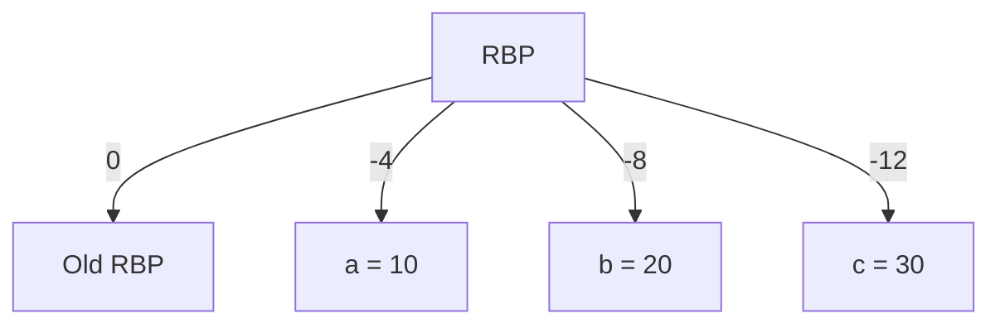
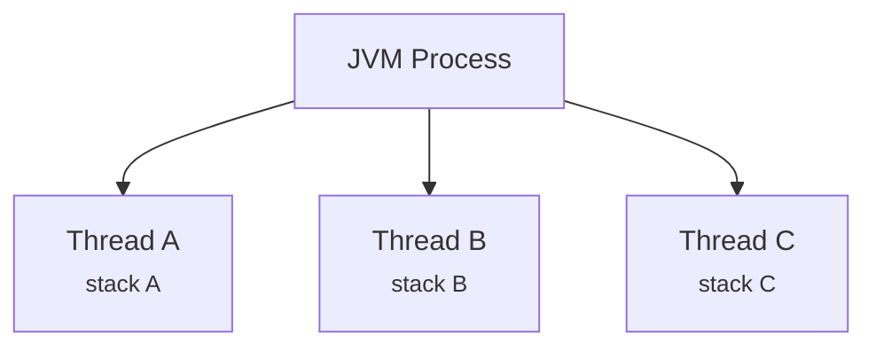
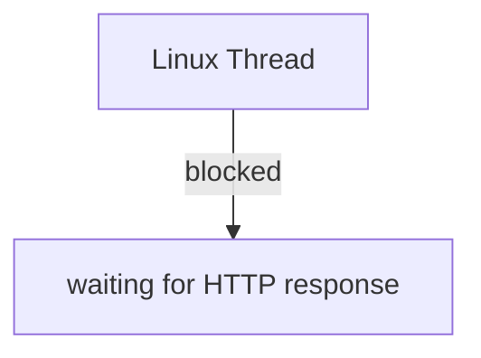
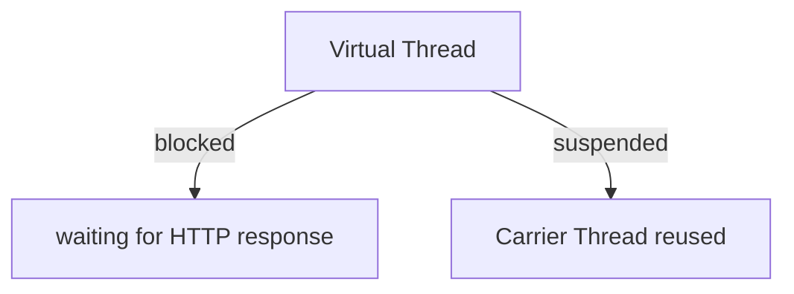

<div class="intro" markdown='1'>
"*100,000 threads in Java? Impossible!*" That's what I hear often.
Yet, since Java 21, it has **become reality** thanks to *Virtual Threads* (Project Loom).

You only really know where you're going when you know where you came from.

That's why, to understand why this is revolutionary, I've decided to revisit the basics with you: **what exactly is a thread?**

And to dive back into the guts of the machine, a bit of assembly will be necessary, because yes, even C hides things from us! If you thought C was a low-level language, you're going to be disappointed. But don't worry, I'll try to make it as digestible as possible.

So we'll answer the question: what is a thread?

Spoiler: it's **neither a unit of computation, nor dark magic**. It's much simpler (and much smarter) than that.

In this article, we will:

- Dive into the guts of the processor (x86 Linux asm, registers, stack, `RIP`, `RSP`...).
- Understand how Linux manages threads (`clone()`, `context switch`...).
- Review how Java accommodated threads up to Java 21.
- See why Java 21 changes the game with Virtual Threads.
- Illustrate with concrete examples in Java.

Ready? Let's go.
</div>

<!--excerpt-->

## The Fundamentals: Processor, Registers, and Stack

### A processor executes only one instruction at a time

Even on a modern machine with multiple cores, **each core executes instructions sequentially**. At any given moment, the CPU knows:

- The current instruction.
- The data being manipulated.
- The location of the stack.

This information is stored in **registers**. On **x86_64**, the key registers are:

| Register | Role |
| -------- | ---- |
| `RIP` | Address of the next instruction |
| `RSP` | Top of the stack (*Stack Pointer*) |
| `RBP` | Reference for the current stack frame (*Base Pointer*) |
| `RAX` | Computation register (accumulator) |

*Why does this matter?* Because these registers **define the exact state of execution** at any moment.

### What exactly is a thread?

Imagine a **desk**:
- **notes** (the stack, or *stack*)
- **a pen** (the CPU registers, like `RIP` or `RSP`)
- **a letter** (the current instruction)

If someone interrupts you: put down the pen (registers), file the notes (stack), note where you were (`RIP`).

A thread is **exactly that**:
- **CPU registers** (`RIP`, `RSP`, `RBP`...)
- **execution stack** (local variables)
- **state** (ready, running, blocked)

*Tip:* Saving this information lets you **interrupt and resume** a program without losing its state. That's the basis of threads.

### A C Example: A Simple Function

Consider this simple C function:

```c
void compute() {
    int a = 10;
    int b = 20;
    int c = a + b;
}
```

In C, it's simple: you declare variables, you do an addition. But **what actually happens** when this function runs? To understand, let's look at its equivalent in **x86_64 assembly** (NASM syntax for Linux):

```nasm
compute:
    push rbp          ; 1. Save the old RBP on the stack
    mov rbp, rsp      ; 2. RBP now points to the top of the stack (frame start)
    
    mov dword [rbp-4], 10  ; 3. Store the value 10 at address RBP-4 (variable a)
    mov dword [rbp-8], 20  ; 4. Store the value 20 at address RBP-8 (variable b)
    
    mov eax, dword [rbp-4] ; 5. Load a into the EAX register
    add eax, dword [rbp-8] ; 6. Add b to EAX (EAX = a + b)
    
    mov dword [rbp-12], eax ; 7. Store the result at RBP-12 (variable c)
    
    pop rbp           ; 8. Restore the old RBP
    ret               ; 9. Return to the caller
```

> But why are you showing us assembly? It looks like gibberish!

I understand your reaction! But believe me, **it's this "gibberish" that explains why a thread can be suspended and resumed**. Let's break it down together, step by step.

### The Basic Vocabulary: RBP, RSP, and the Stack

**The stack**: Imagine a **stack of plates**. You can only stack or unstack from the top. In computing, the stack is a memory area where data is temporarily stored. It grows toward **lower memory addresses** (unlike the heap, which grows upward).

| Concept | Analogy | Role |
|---------|----------|------|
| **RSP** (*Stack Pointer*) | Finger pointing to the **top** of the stack of plates | Register that holds **the address of the current top** of the stack |
| **RBP** (*Base Pointer*) | Label marking the **start** of a set of plates | Register that holds **the base address** of the current *frame* |
| **Stack Frame** | A set of plates for a single "activity" | Portion of the stack reserved for a function, containing its local variables |

*Why two registers?*
- `RSP` **always** points to the current top of the stack (last piece of data pushed)
- `RBP` points to **the start of the frame** of the current function, which makes it easy to access local variables

### Creating a Stack Frame: The Function Prologue

```nasm
push rbp          ; 1. Save the old RBP on the stack
mov rbp, rsp      ; 2. RBP points to the top (frame start)
```

**Step 1: `push rbp`**
- We **push** the current value of `RBP` onto the stack
- `RSP` is decremented by 8 (size of a register on x86_64)
- **Why?** To return to the previous state after execution

**Step 2: `mov rbp, rsp`**
- We copy `RSP` into `RBP`
- `RBP` now points to **the start of the new frame**

**Result**: We've created a **new stack frame** for `compute()`.

### Storing Local Variables

```nasm
mov dword [rbp-4], 10  ; a = 10
mov dword [rbp-8], 20  ; b = 20
```

**`dword`** = *double word* = **4 bytes** (32 bits), the size of an `int` in C.

- `[rbp-4]`: "At the address 4 bytes **before** RBP"
- `[rbp-8]`: "At the address 8 bytes **before** RBP"

**Visualization:**

```
Memory address: ... | ... | Old RBP | a=10 | b=20 | c=?(empty)
                    ↑                       ↑       ↑
                    RSP                     RBP     RBP-4  RBP-8
```

Each local variable is at a **negative offset** relative to `RBP`.

### The Addition: Using CPU Registers

```nasm
mov eax, dword [rbp-4] ; EAX = a
add eax, dword [rbp-8] ; EAX += b
```

**EAX** is a **general-purpose** CPU register (32 bits), among `EAX`, `EBX`, `ECX`, `EDX`.

- `mov eax, dword [rbp-4]`: Copies the value at `RBP-4` into `EAX`
- `add eax, dword [rbp-8]`: Adds the value at `RBP-8` to `EAX`

**Why EAX?** Arithmetic operations are **faster** in CPU registers than in memory.

### Storing the Result and Exiting the Function

```nasm
mov dword [rbp-12], eax ; c = EAX

pop rbp           ; 8. Restore the old RBP
ret               ; 9. Return to the caller
```

- `mov dword [rbp-12], eax`: Stores the result at `RBP-12` (variable `c`)
- `pop rbp`: Restores the previous value of `RBP`
- `ret`: Returns to the address stored on the stack

### Stack Visualization

During the execution of `compute()`, the stack looks like:



*Key takeaway:* Local variables (`a`, `b`, `c`) are **stored on the stack**, at offsets relative to `RBP`.

### Why is all this important for understanding threads?

What's **remarkable** is that **this stack frame + registers mechanism is exactly what allows a thread to be suspended and resumed**:

1. **A thread is an execution state**: When we "suspend" a thread, we must save:
   - The value of **RBP** (where is the current frame?)
   - The value of **RSP** (where is the stack at?)
   - The value of **RIP** (*Instruction Pointer* - what is the next instruction?)
   - The values of all **registers** (EAX, EBX, etc.)
   
2. **The stack holds the context**: All local variables (`a`, `b`, `c`) are in the stack frame. If we save `RBP` and `RSP`, we save **the entire context** of the function.

3. **CPU registers define execution**: `RIP` says **which instruction to execute next**, and `RSP`/`RBP` say **where the data is**. Without these registers, the CPU wouldn't know what to do!

**Final analogy:**
> Imagine you are writing a letter (the `compute` function).
> - Your **desk** is the **stack**
> - Your **pen and current notes** are the **CPU registers** (EAX, RIP, RSP, RBP)
> - If someone interrupts you, you put down your pen (`registers`), file your notes (`stack`), and note where you were (`RIP`)
> - When you resume, you have everything at hand to continue exactly where you left off

That's **exactly** how a thread works, and it's **exactly** this context (registers + stack) that must be saved and restored when switching from one thread to another.

### Where does the JVM fit in?

You might be wondering: *But how does Java handle all this?* After all, when we create a `Thread` in Java, we don't directly see the `RIP`, `RSP`, or `RBP` registers.

**The JVM has its own execution model:**

Contrary to what one might think, **the JVM does not use "virtual registers"** like `RIP` or `RSP`. These registers (`RIP`, `RSP`, `RBP`, `RAX`...) are **physical registers** of the x86_64 processor, managed by the **operating system** and the **hardware**, not by the JVM.

**So, how does the JVM manage threads?**

The JVM is designed as a **stack-based machine**. For each thread, it maintains:

- **A *program counter* (pc) register**: Each JVM thread has its own `pc` register that points to the **next JVM instruction** (bytecode) to execute. It's the conceptual equivalent of the CPU's `RIP`, but at the JVM level.
- **A local variables array** (*local variables array*): Stored in memory, it plays a role similar to registers for storing method arguments and local variables.
- **An operand stack** (*operand stack*): Used for intermediate computations.

*Why does this matter?* Because when we talk about **suspending a Java thread**, the JVM can **save and restore** the `pc` and the stack of each thread **without kernel intervention**. This is exactly what allows **Virtual Threads** to be so lightweight: the JVM manages their context (pc + stack) itself and can suspend/reactivate them **without blocking an OS thread**.

**In summary:**

| Level          | Instruction register | Data registers | Type          |
|-----------------|------------------------|----------------------|---------------|
| x86_64 CPU      | `RIP`                  | `RSP`, `RBP`, `RAX`... | **Physical** registers |
| JVM             | `pc` register          | Local variables + stack | **Stack-based** (in memory) |

*Key takeaway:* The JVM doesn't have virtual registers like the CPU. It is *stack-based* and manages its own `pc` per thread, which lets it efficiently suspend Virtual Threads.

## Processes and Threads under Linux

### Creating a Process

When a Java program starts:

```bash
java MyApplication
```

The Linux kernel creates a **process** containing:
- executable **code**
- **global variables**
- **heap** (dynamic memory)

### Threads within a Process

A process can contain **multiple threads**:



**Shared:** heap, global variables, open sockets and files.

**Specific to each thread:** stack and registers (execution context).

### Creating a Thread under Linux: `clone()`

Linux uses `clone()` to create a thread (as opposed to `fork()` for a process).

Example:

```c
clone(
    worker,           // Function to execute
    stack,            // Thread stack
    CLONE_VM | CLONE_FILES, // Share memory and files
    NULL
);
```

**Key options:**

- `CLONE_VM`: The thread shares **memory** with its parent.
- `CLONE_FILES`: The thread shares **open files**.

*Why does this matter?* Because `clone()` lets you **create lightweight threads** that share resources, unlike `fork()` which duplicates everything.

### How do we ask the scheduler to run a thread?

Once a thread is created with `clone()`, it's **added to the list of threads ready to run** in the Linux kernel. But how does the scheduler know it should run it?

In reality, **the thread is already ready to run as soon as it's created**. The Linux kernel uses a **runqueue** of ready threads. When a thread is created, it's **automatically placed in this queue**.

The scheduler, which runs continuously in the kernel, **walks this queue** and **chooses the next thread to execute** based on its **scheduling policy** (for example, the *Completely Fair Scheduler* or CFS, used by default in Linux).

*Little tip:* The scheduler doesn't just wait passively. It is **woken up** by **hardware interrupts** (like the CPU timer, which triggers a *tick* every few milliseconds) or by **system calls** (like `clone()`). At each *tick*, the scheduler **evaluates** whether the current thread should be **interrupted** (for example, if it has used up its *time quantum*) and **chooses** the next thread to run.

## The Scheduler and Context Switching

### The Linux Scheduler

Suppose a machine with:

- **1 CPU**.
- **3 threads** (A, B, C).

The CPU can only execute **one thread at a time**. Linux **alternates** their execution:

| Time | Thread executed |
| ----- | -------------- |
| 0 ms  | Thread A       |
| 5 ms  | Thread B       |
| 10 ms | Thread C       |
| 15 ms | Thread A       |

This decision is made by the **scheduler**.

### Context Switching

**Scenario:**

- **Thread A** is currently executing (`RIP = 100`, `RSP = 1000`).
- The scheduler decides to switch to **Thread B**.

**Steps:**

- Linux **saves** the state of Thread A:
  - `RIP = 100`
  - `RSP = 1000`
  - Other registers.
- Linux **restores** the state of Thread B:
  - `RIP = 500`
  - `RSP = 2000`
- Execution **immediately** resumes for Thread B.

*Why is this costly?* Because saving and restoring registers and the stack **takes time**. The more threads there are, the more frequent the `context switch`.

### Comparison with Reactive Programming and I/O Threads

#### Reactive Programming (e.g., Netty, Vert.x, Spring WebFlux)

**A limited number of threads** (≈ number of CPU cores) + **event-driven model**:
- 1 thread (or small pool) handles **thousands of connections** via callbacks or `CompletableFuture`
- **No blocking**: **non-blocking** I/O (e.g., `select()`, `epoll()`)
- Vert.x/Quarkus use the **EventBus** for asynchronous communication

**Example with Vert.x:**

```java
vertx.eventBus().send("news.feed", "New article published!");
vertx.eventBus().consumer("news.feed", message -> {
    System.out.println("Message received: " + message.body());
});
```

**Advantages:** economical, scalable, ideal for microservices.

**Disadvantages:** complex code (callback hell, Mono/Flux), steep learning curve.

*Important:* avoids blocking via **async handlers** and EventBus → highly performant for I/O-bound workloads.

**Example Spring WebFlux:**

```java
webClient.get()
    .uri("/api/data")
    .retrieve()
    .bodyToMono(String.class)
    .flatMap(response -> Mono.just(process(response)))
    .subscribe(result -> System.out.println(result));
```

#### I/O Threads (e.g., Classic Thread Pools)

This approach uses a **pool of threads dedicated to I/O operations**:
- Large number of threads (e.g., 100-1000) for blocking tasks
- Each thread **blocked** during I/O (disk read, HTTP request)

**Advantages:** simple, imperative code.

**Disadvantages:** memory-intensive (1-8 MB/stack), limited scalability.

**Example:**

```java
ExecutorService executor = Executors.newFixedThreadPool(100);
IntStream.range(0, 1000).forEach(i -> {
    executor.submit(() -> {
        try {
            Thread.sleep(100);
        } catch (InterruptedException e) {}
    });
});
```

#### Node.js: The Event-Driven Model Pushed to the Extreme

Node.js popularized a **100% event-driven** model with a **single thread** (the *Event Loop*):
- 1 thread handles **all requests** via callbacks and promises
- **Non-blocking** I/O thanks to **libuv** (`epoll` on Linux, `kqueue` on BSD)

**Advantages:** very lightweight, scalable for I/O-bound workloads.

**Disadvantages:** complex asynchronous code, not suited for CPU-bound work.

**Example:**

```javascript
const fs = require('fs');
fs.readFile('file.txt', 'utf8', (err, data) => {
    if (err) throw err;
    console.log(data);
});
```

#### Virtual Threads: The Best of Both Worlds?

Virtual Threads **combine the advantages** of previous approaches:
- Simple, imperative code (like I/O Threads)
- Lightweight and scalable (like reactive/Node.js)
- No callback hell: **sequential** code that appears blocking but **does not block OS threads**

**Example:**

```java
try (var executor = Executors.newVirtualThreadPerTaskExecutor()) {
    IntStream.range(0, 10_000).forEach(i -> {
        executor.submit(() -> {
            String data = httpClient.send(request).body();
            System.out.println(data);
        });
    });
}
```

*Why is this revolutionary?* Because Virtual Threads **democratize** the scalability of reactive models **without their complexity**. We can finally write **simple, readable, and performant** code for I/O-bound applications.

#### Quarkus and Virtual Threads: The `@RunOnVirtualThread` Annotation

Quarkus, as a modern cloud framework, **quickly adopted** Virtual Threads. The **`@RunOnVirtualThread` annotation** (package `io.smallrye.common.annotation`):
- Marks a method (REST endpoint, message consumer) for **automatic execution on a Virtual Thread**
- Prevents blocking the **Event Loop threads** (RESTEasy Reactive) or **worker threads**

**Example:**

```java
import io.smallrye.common.annotation.RunOnVirtualThread;
import jakarta.ws.rs.GET;
import jakarta.ws.rs.Path;

@Path("/api/demo")
public class VirtualThreadResource {
    @GET
    @Path("/hello")
    @RunOnVirtualThread
    public String hello() {
        return "Hello from: " + Thread.currentThread();
    }
}
```

**Key points:** transparent integration, compatibility with REST and messaging, **only with `@Blocking`** under RESTEasy Reactive.

*Useful:* progressive migration to Virtual Threads **without rewriting** everything as reactive → imperative style + scalability.

## Why Native Threads Are Costly

### The Memory Cost of a Thread

Each native thread on Linux **reserves** ~1 MB of virtual address space for its stack (via `VmSize`), but actually consumes only ~15-20 KB of physical memory (`VmRSS`) as long as the stack is not used.

**Example:** `10,000 threads × 1 MB = 10 GB of reserved virtual address space`

**In reality:** `10,000 threads × 15 KB = ~150 MB of physical memory`

*Tip:* Use `/proc/<pid>/status` to see `VmSize` (reservation) vs `VmRSS` (actual consumption).

### The Problem with Modern Applications

Take a typical **REST API**:


Time: **95% waiting** (network, disk, DB), **5% computing** (CPU).

**Problem:** While waiting, the thread **does nothing**, yet occupies memory and saturates the scheduler.

### Java Before Loom: 1 Java Thread = 1 Linux Thread

Until Java 20, every Java `Thread` corresponded to **a native Linux thread**:

```java
IntStream.range(0, 10_000).forEach(i -> {
    new Thread(() -> {
        try {
            Thread.sleep(1000);
        } catch (InterruptedException e) {}
    }).start();
});
```
**Result:** ~150 MB of physical memory (VmRSS), ~10 GB of reserved virtual address space (VmSize), potentially overloaded scheduler.

*Problem:* these threads **do nothing** (they wait).

*Solution:* **reactive** frameworks → few threads + callbacks.

## Virtual Threads: The Loom Revolution

### What is a Virtual Thread?

Introduced with **Java 21** (JEP 444), *Virtual Threads* are **lightweight** threads managed by the **JVM**, and **not directly by the OS**.

- **1 OS thread** (Carrier Thread) can run **thousands of Virtual Threads**.
- They are **perfect for blocking tasks** (I/O, network, etc.).

*Why is this revolutionary?* Because the JVM can **manage thousands of lightweight threads itself**, without saturating the system.

### Architecture: Virtual Threads + Carrier Threads

<div class="mermaid">
graph TD
    A[100,000 Virtual Threads] -->|Managed by| B[JVM]
    B -->|Scheduled on| C[Carrier Threads e.g. 8]
    C -->|Executed by| D[Linux Threads e.g. 8]
</div>

- **Virtual Threads**: JVM objects (invisible to Linux)
- **Carrier Threads**: real Linux threads
- The JVM **schedules** Virtual Threads onto Carrier Threads

### What happens during a blocking call?

**Before Loom:**



→ The thread **stays blocked** and **occupies an OS thread**.

**With Loom:**



→ The JVM **suspends** the Virtual Thread, the **Carrier Thread** is **reused**.

*Why is this clever?* Because the OS thread is **no longer wasted** waiting.

### Java Example with Virtual Threads

```java
// Solution: 10,000 Virtual Threads = no problem
try (var executor = Executors.newVirtualThreadPerTaskExecutor()) {
    IntStream.range(0, 10_000).forEach(i -> {
        executor.submit(() -> {
            try {
                Thread.sleep(100);
                System.out.println("Task " + i + " completed by " + Thread.currentThread());
            } catch (InterruptedException e) {
                throw new RuntimeException(e);
            }
        });
    });
}
```

**Result:**

- **Memory**: ~50 MB (similar to native threads for this workload).
- **Execution time**: ~137 ms (instead of ~822 ms with native threads).
- **OS threads**: 8 (Carrier Threads) instead of 10,000.

## Benchmark: Native Threads vs Virtual Threads

### Tested Scenario

- **10,000 tasks** simulating blocking calls (100 ms latency).
- Measurement of **total time** and **memory consumption** (VmRSS).

### Results (Machine: 8 CPUs, 16 GB RAM)

| Criterion          | Native Threads      | Virtual Threads        |
| ------- | --------------- | --------------- |
| Time | ~822 ms | ~137 ms |
| Memory (VmRSS) | ~40 MB | ~50 MB |
| OS threads | 10,000 | 8 (Carrier) |
| Scalability | Limited by memory | Very high (millions) |

**Note:** The main benefit of Virtual Threads is not speed (6x faster here), but **scalability**: they allow creating hundreds of thousands of threads without scheduler saturation or memory explosion.

## Why is this Revolutionary?

With Virtual Threads, you can write **classic imperative** code:

```java
// Simple and readable code
String response = httpClient.send(request).body();
```

**But behind the scenes:**

- The Java thread **no longer occupies a dedicated OS thread**.
- **No saturation** of the system.
- **Reduced memory consumption**.

**Result:**

- **Simple code** (no need for callbacks or `CompletableFuture`).
- **Massive scalability** (millions of virtual threads).
- **Efficiency** (no wasted resources).

## Limitations and Points to Watch

### Avoid `synchronized` for Blocking I/O

`synchronized` causes **pinning**: the Virtual Thread cannot be "unmounted" from the carrier thread during the critical section. If you perform a blocking operation (sleep, I/O) inside `synchronized`, the carrier thread remains pinned.

**Example to avoid:**

```java
synchronized (this) {
    Thread.sleep(1000); // Blocks the Carrier Thread!
}
```

**Solution:** non-blocking locks (`ReentrantLock` with `tryLock()`), concurrent structures (`ConcurrentHashMap`, `AtomicInteger`).

### Be Careful with `ThreadLocal`

`ThreadLocal` creates a copy of the data **for each Virtual Thread**. If you have 50,000 VTs with 100 KB of data each, that consumes ~5 GB of memory. It's not a leak, but consumption proportional to the number of VTs.

**Solution:** pass data **as a parameter**, or use `ScopedValue` (Java 24+) which shares a single instance.

### No `Thread.stop()`

**Deprecated** and **dangerous** method, especially with Virtual Threads.

### CPU-bound Tasks

Virtual Threads **do not speed up** heavy computations (e.g., image processing, cryptography).

**Solution:** native threads (`ForkJoinPool`, `Executors.newFixedThreadPool()`).

### Complex Debugging

Stack traces are **harder** to analyze (thousands of virtual threads).

**Tools:** JFR, VisualVM, Async Profiler.

## Best Practices with Virtual Threads

### Use `Structured Concurrency` (Java 21)

Manage tasks in a **hierarchical** and **safe** way:

```java
import java.util.concurrent.StructuredTaskScope;

try (var scope = new StructuredTaskScope.ShutdownOnFailure()) {
    var task1 = scope.fork(() -> fetchUser());
    var task2 = scope.fork(() -> fetchOrders());
    
    scope.join();          // Wait for tasks to finish
    scope.throwIfFailed(); // Propagate exceptions
    
    System.out.println("User: " + task1.get() + ", Orders: " + task2.get());
}
```

**Advantages:**

- **Error handling** simplified.
- **Automatic cancellation** of tasks on failure.

### Avoid Long Blocks

A task that is **too long** can impact performance.

**Solution:**

- **Break up** long tasks into subtasks.
- Use **timeouts** (`CompletableFuture.orTimeout()`).

### Load Test

Measure the impact on your application with:

- **JMH** (micro benchmarks).
- **Gatling** (load tests).
- **Prometheus + Grafana** (monitoring).

## Migration to Virtual Threads

### Key Steps

- **Upgrade to Java 21+** (LTS recommended).
- **Identify blocking points** in your code (tools: **JFR, Async Profiler**).
- **Replace `ExecutorService`**:
  - **Before:** `Executors.newFixedThreadPool(100)`
  - **After:** `Executors.newVirtualThreadPerTaskExecutor()`
- **Eliminate `synchronized`** in favor of non-blocking locks.
- **Load test** to validate performance.

### Migration Example

**Before (Native Threads):**

```java
ExecutorService executor = Executors.newFixedThreadPool(100);
IntStream.range(0, 1000).forEach(i -> {
    executor.submit(() -> {
        // Blocking task
        Thread.sleep(100);
    });
});
executor.shutdown();
```

**After (Virtual Threads):**

```java
// Solution: 10,000 Virtual Threads = no problem
try (var executor = Executors.newVirtualThreadPerTaskExecutor()) {
    IntStream.range(0, 1000).forEach(i -> {
        executor.submit(() -> {
            Thread.sleep(100);
        });
    });
}
```

## When to Use Virtual Threads?

### Recommended Use Cases

- HTTP servers (Spring Boot 3.2+, Quarkus, Micronaut)
- I/O-heavy applications (DB, files, network)
- Asynchronous processing (emails, notifications)
- Microservices with thousands of concurrent requests

### Cases to Avoid

- CPU-intensive computations (image processing, cryptography)
- Legacy code with `synchronized` or `ThreadLocal`
- Incompatible libraries (check Java 21 support)

## In Conclusion

Virtual Threads are **not a fad**. They are the answer to **20 years of limitations** in Java's thread management.

**What to remember:**

- A thread is **registers + stack + state**. Nothing more.
- Before Java 21, **1 Java Thread = 1 Linux Thread** → **costly and poorly scalable**.
- With Loom, **1 Linux thread can handle thousands of Virtual Threads** → **lightweight and ultra-scalable**.

**Next step?**

- **Try** Virtual Threads in a test project.
- **Measure** gains with tools like JMH or Gatling.
- **Adopt** best practices (avoid `synchronized`, use `StructuredTaskScope`...).

*And above all: have fun!* Because concurrent programming has **never been this simple**.

> *"A thread is like a desk: the more you have, the more you can do in parallel... as long as you don't mix everything up."*  
> **- François-Xavier ROBIN**