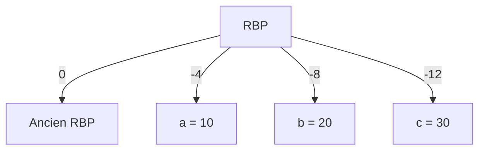
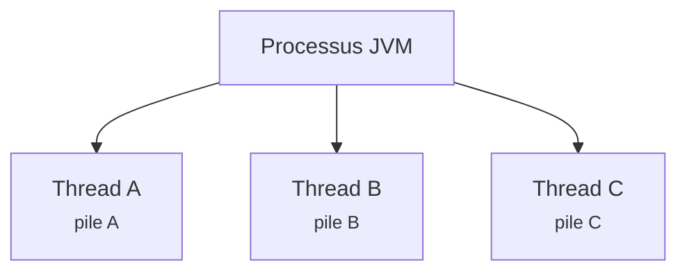
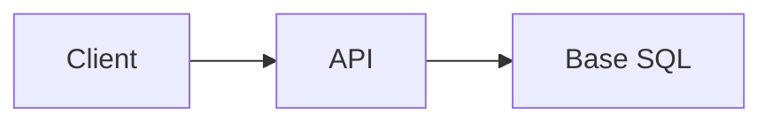
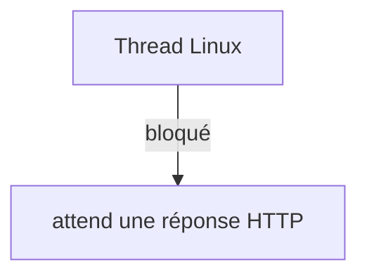
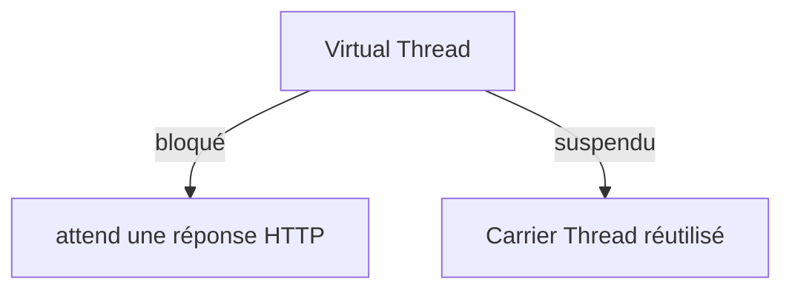

<div class="intro" markdown='1'>
"*100 000 threads en Java ? Impossible !*" C'est ce que j'entends souvent.
Pourtant, depuis Java 21, c'est **devenu réalité** grâce aux *Virtual Threads* (projet Loom).

On ne sait vraiment où on va que quand on sait d'où l'on vient.

C'est pourquoi j'ai décidé, pour comprendre pourquoi c'est révolutionnaire, de ré-aborder les bases avec vous : **qu'est-ce qu'un thread, au juste ?**

Et histoire de replonger dans les entrailles de la machine, un peu d'assembleur sera nécessaire, car oui même le C nous cache des choses ! Si vous pensiez que C était un langage de bas niveau vous allez être déçu. Mais ne vous en faites pas, je vais essayer de rendre cela le plus digeste possible.

Et donc nous répondrons à la question qu'et-ce un thread ?

Spoiler : ce n'est **ni une unité de calcul, ni une magie noire**. C'est bien plus simple (et bien plus malin) que ça.

Dans cet article, nous allons :

- Plonger dans les entrailles du processeur (asm x86 linux, registres, pile, `RIP`, `RSP`...).
- Comprendre comment Linux gère les threads (`clone()`, `context switch`…).
- Revoir comment Java s'accomodait des threads jusqu'à Java 21
- Voir pourquoi Java 21 change la donne avec les Virtual Threads.
- Illustrer avec des exemples concrets en Java.

Prêt ? C'est parti.
</div>

<!--excerpt-->

## Les Fondamentaux : Processeur, Registres et Pile

### Un processeur n'exécute qu'une seule instruction à la fois

Même sur une machine moderne avec plusieurs cœurs, **chaque cœur exécute les instructions séquentiellement**. À un instant donné, le CPU connaît :

- L'instruction en cours.
- Les données manipulées.
- L'emplacement de la pile.

Ces informations sont stockées dans des **registres**. Sur **x86_64**, les registres clés sont :

| Registre | Rôle |
| -------- | ---- |
| `RIP` | Adresse de la prochaine instruction |
| `RSP` | Sommet de la pile (*Stack Pointer*) |
| `RBP` | Référence de la pile courante (*Base Pointer*) |
| `RAX` | Registre de calcul (accumulateur) |

*Pourquoi c'est important ?* Parce que ces registres **définissent l'état exact de l'exécution** à tout moment.

### Un thread, c'est quoi au juste ?

Imaginons un **bureau** :
- **des notes** (la pile, ou *stack*)
- **un stylo** (les registres CPU, comme `RIP` ou `RSP`)
- **une lettre** (l'instruction en cours)

Si on vous interrompt : poser le stylo (registres), ranger les notes (pile), noter où vous en étiez (`RIP`).

Un thread, c'est **exactement ça** :
- **registres CPU** (`RIP`, `RSP`, `RBP`…)
- **pile d'exécution** (variables locales)
- **état** (prêt, en cours, bloqué)

*Astuce :* Sauvegarder ces informations permet d'**interrompre et reprendre** un programme sans perdre son état. C'est la base des threads.

### Exemple en C : Une fonction simple

Considérons cette fonction C simple :

```c
void calcul() {
    int a = 10;
    int b = 20;
    int c = a + b;
}
```

En C, c'est simple : on déclare des variables, on fait une addition. Mais **que se passe-t-il réellement** quand cette fonction s'exécute ? Pour le comprendre, regardons son équivalent en **assembleur x86_64** (syntaxe NASM pour Linux) :

```nasm
calcul:
    push rbp          ; 1. Sauvegarde l'ancien RBP sur la pile
    mov rbp, rsp      ; 2. RBP pointe maintenant sur le sommet de la pile (début du frame)
    
    mov dword [rbp-4], 10  ; 3. Stocke la valeur 10 à l'adresse RBP-4 (variable a)
    mov dword [rbp-8], 20  ; 4. Stocke la valeur 20 à l'adresse RBP-8 (variable b)
    
    mov eax, dword [rbp-4] ; 5. Charge a dans le registre EAX
    add eax, dword [rbp-8] ; 6. Additionne b à EAX (EAX = a + b)
    
    mov dword [rbp-12], eax ; 7. Stocke le résultat à RBP-12 (variable c)
    
    pop rbp           ; 8. Restaure l'ancien RBP
    ret               ; 9. Retourne à l'appelant
```

> Mais pourquoi tu nous montres de l'assembleur ? On dirait du charabia !

Je comprends votre réaction ! Mais croyez-moi, **c'est ce "charabia" qui explique pourquoi un thread peut être suspendu et repris**. Décomposons ensemble, pas à pas.

### Le vocabulaire de base : RBP, RSP, et la pile

**La pile (stack)** : Imaginez une **pile d'assiettes**. Vous ne pouvez empiler ou dépiler que par le dessus. En informatique, la pile est une zone mémoire où l'on stocke temporairement des données. Elle grandit vers les **adresses mémoire basses** (contrairement au heap qui grandit vers le haut).

| Concept | Analogie | Rôle |
|---------|----------|------|
| **RSP** (*Stack Pointer*) | Doigt qui montre le **sommet** de la pile d'assiettes | Registre qui contient **l'adresse du sommet actuel** de la pile |
| **RBP** (*Base Pointer*) | Étiquette qui marque le **début** d'un ensemble d'assiettes | Registre qui contient **l'adresse de base** du *frame* actuel |
| **Frame de pile** (*Stack Frame*) | Un ensemble d'assiettes pour une même "activité" | Zone de la pile réservée à une fonction, contenant ses variables locales |

*Pourquoi deux registres ?* 
- `RSP` pointe **toujours** sur le sommet actuel de la pile (dernière donnée empilée)
- `RBP` pointe sur **le début du frame** de la fonction en cours, ce qui permet d'accéder facilement aux variables locales

### La création d'un frame de pile : le prologue de la fonction

```nasm
push rbp          ; 1. Sauvegarde l'ancien RBP sur la pile
mov rbp, rsp      ; 2. RBP pointe sur le sommet (début du frame)
```

**Étape 1 : `push rbp`**
- On **empile** la valeur actuelle de `RBP`
- `RSP` est décrémenté de 8 (taille d'un registre sur x86_64)
- **Pourquoi ?** Pour revenir à l'état précédent après l'exécution

**Étape 2 : `mov rbp, rsp`**
- On copie `RSP` dans `RBP`
- `RBP` pointe sur **le début du nouveau frame**

**Résultat** : On a créé un **nouveau frame de pile** pour `calcul()`.

### Le stockage des variables locales

```nasm
mov dword [rbp-4], 10  ; a = 10
mov dword [rbp-8], 20  ; b = 20
```

**`dword`** = *double word* = **4 octets** (32 bits), taille d'un `int` en C.

- `[rbp-4]` : "À l'adresse 4 octets **avant** RBP"
- `[rbp-8]` : "À l'adresse 8 octets **avant** RBP"

**Visualisation :**

```
Adresse mémoire : ... | ... | Ancien RBP | a=10 | b=20 | c=?(vide)
                   ↑                       ↑       ↑
                   RSP                     RBP     RBP-4  RBP-8
```

Chaque variable locale est à un **offset négatif** par rapport à `RBP`.

### L'addition : utiliser les registres CPU

```nasm
mov eax, dword [rbp-4] ; EAX = a
add eax, dword [rbp-8] ; EAX += b
```

**EAX** est un **registre généraliste** du CPU (32 bits), parmi `EAX`, `EBX`, `ECX`, `EDX`.

- `mov eax, dword [rbp-4]` : Copie la valeur à `RBP-4` dans `EAX`
- `add eax, dword [rbp-8]` : Ajoute la valeur à `RBP-8` à `EAX`

**Pourquoi EAX ?** Les opérations arithmétiques sont **plus rapides** dans les registres CPU que en mémoire.

### Stocker le résultat et quitter la fonction

```nasm
mov dword [rbp-12], eax ; c = EAX

pop rbp           ; 8. Restaure l'ancien RBP
ret               ; 9. Retourne à l'appelant
```

- `mov dword [rbp-12], eax` : Stocke le résultat à `RBP-12` (variable `c`)
- `pop rbp` : Restaure la valeur précédente de `RBP`
- `ret` : Retourne à l'adresse stockée sur la pile

### Visualisation de la pile

Pendant l'exécution de `calcul()`, la pile ressemble à :



*À retenir :* Les variables locales (`a`, `b`, `c`) sont **stockées dans la pile**, à des offsets relatifs à `RBP`.

### Pourquoi tout ça est-il important pour comprendre les threads ?

Ce qui est fascinant, c'est que **ce mécanisme de frame de pile + registres est exactement ce qui permet de suspendre et reprendre un thread** :

1. **Un thread, c'est un état d'exécution** : Quand on "suspend" un thread, il faut sauvegarder :
   - La valeur de **RBP** (où est le frame actuel ?)
   - La valeur de **RSP** (où en est la pile ?)
   - La valeur de **RIP** (*Instruction Pointer* - quelle est la prochaine instruction ?)
   - Les valeurs de tous les **registres** (EAX, EBX, etc.)
   
2. **La pile contient le contexte** : Toutes les variables locales (`a`, `b`, `c`) sont dans le frame de pile. Si on sauvegarde `RBP` et `RSP`, on sauvegarde **tout le contexte** de la fonction.

3. **Les registres CPU définissent l'exécution** : `RIP` dit **quelle instruction exécuter ensuite**, et `RSP`/`RBP` disent **où sont les données**. Sans ces registres, le CPU ne saurait pas quoi faire !

**Analogie finale :**
> Imaginez que vous êtes en train d'écrire une lettre (la fonction `calcul`).
> - Votre **bureau** c'est la **pile** (stack)
> - Votre **stylo et vos notes en cours** ce sont les **registres CPU** (EAX, RIP, RSP, RBP)
> - Si on vous interrompt, vous posez votre stylo (`registres`), vous rangez vos notes (`pile`), et vous notez où vous en étiez (`RIP`)
> - Quand vous reprenez, vous avez tout sous la main pour continuer exactement là où vous vous étiez arrêté

C'est **exactement** comme ça qu'un thread fonctionne, et c'est **exactement** ce contexte (registres + pile) qui doit être sauvegardé et restauré quand on passe d'un thread à un autre.

### Et la JVM dans tout ça ?

Vous vous demandez peut-être : *Mais comment Java gère tout ça ?* Après tout, quand on crée un `Thread` en Java, on ne voit pas directement les registres `RIP`, `RSP` ou `RBP`.

**La JVM a son propre modèle d'exécution** :

Contrairement à ce qu’on pourrait croire, **la JVM n’utilise pas de "registres virtuels"** comme `RIP` ou `RSP`. Ces registres (`RIP`, `RSP`, `RBP`, `RAX`…) sont des **registres physiques** du processeur x86_64, gérés par le **système d’exploitation** et le **matériel**, pas par la JVM.

**Alors, comment la JVM gère-t-elle les threads ?**

La JVM est conçue comme une **machine à pile** (*stack-based*). Pour chaque thread, elle maintient :

- **Un *program counter* (pc) register** : Chaque thread JVM a son propre registre `pc` qui pointe vers la **prochaine instruction JVM** (bytecode) à exécuter. C’est l’équivalent conceptuel du `RIP` du CPU, mais au niveau JVM.
- **Un tableau de variables locales** (*local variables array*) : Stocké en mémoire, il joue un rôle similaire à des registres pour stocker les arguments de méthode et les variables locales.
- **Une pile d’exécution** (*operand stack*) : Utilisée pour les calculs intermédiaires.

*Pourquoi c’est important ?* Parce que quand on parle de **suspendre un thread Java**, la JVM peut **sauvegarder et restaurer** le `pc` et la pile de chaque thread **sans intervention du noyau**. C’est exactement ce qui permet aux **Virtual Threads** d’être aussi légers : la JVM gère elle-même leur contexte (pc + pile) et peut les suspendre/réactiver **sans bloquer un thread OS**.

**En résumé :**

| Niveau          | Registre d'instruction | Registres de données | Type          |
|-----------------|------------------------|----------------------|---------------|
| CPU x86_64      | `RIP`                  | `RSP`, `RBP`, `RAX`… | Registres **physiques** |
| JVM             | `pc` register          | Variables locales + pile | **Stack-based** (en mémoire) |

*À retenir :* La JVM n’a pas de registres virtuels comme le CPU. Elle est *stack-based* et gère son propre `pc` par thread, ce qui lui permet de suspendre efficacement les Virtual Threads.

## Processus et Threads sous Linux

### Création d'un processus

Lorsqu'un programme Java démarre :

```bash
java MonApplication
```

Le noyau Linux crée un **processus** contenant :
- **code** exécutable
- **variables globales**
- **heap** (mémoire dynamique)

### Threads dans un processus

Un processus peut contenir **plusieurs threads** :



**Partagé :** heap, variables globales, sockets et fichiers ouverts.

**Propre à chaque thread :** pile (stack) et registres (contexte d'exécution).

### Création d'un thread sous Linux : `clone()`

Linux utilise `clone()` pour créer un thread (contrairement à `fork()` pour un processus).

Exemple :

```c
clone(
    worker,           // Fonction à exécuter
    stack,            // Pile du thread
    CLONE_VM | CLONE_FILES, // Partage mémoire et fichiers
    NULL
);
```

**Options clés :**

- `CLONE_VM` : Le thread partage la **mémoire** avec son parent.
- `CLONE_FILES` : Le thread partage les **fichiers ouverts**.

*Pourquoi c'est important ?* Parce que `clone()` permet de **créer des threads légers** qui partagent des ressources, contrairement à `fork()` qui duplique tout.

### Comment demander au scheduler d'exécuter un thread ?

Une fois qu'un thread est créé avec `clone()`, il est **ajouté à la liste des threads prêts à être exécutés** dans le noyau Linux. Mais comment le scheduler sait-il qu'il doit l'exécuter ?

En réalité, **le thread est déjà prêt à être exécuté dès sa création**. Le noyau Linux utilise une **file d'attente des threads prêts** (*runqueue*). Lorsqu'un thread est créé, il est **automatiquement placé dans cette file**. 

Le scheduler, qui tourne en permanence dans le noyau, **parcourt cette file** et **choisit le prochain thread à exécuter** en fonction de sa **politique d'ordonnancement** (par exemple, *Completely Fair Scheduler* ou CFS, utilisé par défaut dans Linux).

*Petite astuce :* Le scheduler ne se contente pas d'attendre passivement. Il est **réveillé** par des **interruptions matérielles** (comme le timer du CPU, qui déclenche un *tick* toutes les quelques millisecondes) ou par des **appels système** (comme `clone()`). À chaque *tick*, le scheduler **évalue** si le thread en cours doit être **interrompu** (par exemple, s'il a utilisé son *quantum de temps*) et **choisit** le prochain thread à exécuter.

## Le Scheduler et le Context Switch

### Le Scheduler Linux

Supposons une machine avec :

- **1 CPU**.
- **3 threads** (A, B, C).

Le CPU ne peut exécuter **qu'un seul thread à la fois**. Linux **alterne** leur exécution :

| Temps | Thread exécuté |
| ----- | -------------- |
| 0 ms  | Thread A       |
| 5 ms  | Thread B       |
| 10 ms | Thread C       |
| 15 ms | Thread A       |

Cette décision est prise par le **scheduler** (ordonnanceur).

### Le Context Switch

**Scénario :**

- Le **Thread A** est en cours d'exécution (`RIP = 100`, `RSP = 1000`).
- Le scheduler décide de basculer vers le **Thread B**.

**Étapes :**

- Linux **sauvegarde** l'état du Thread A :
  - `RIP = 100`
  - `RSP = 1000`
  - Autres registres.
- Linux **restaure** l'état du Thread B :
  - `RIP = 500`
  - `RSP = 2000`
- L'exécution reprend **immédiatement** pour le Thread B.

*Pourquoi c'est coûteux ?* Parce que sauvegarder et restaurer les registres et la pile **prend du temps**. Plus il y a de threads, plus le `context switch` est fréquent.

### Comparaison avec la programmation réactive et les I/O Threads

#### La programmation réactive (ex: Netty, Vert.x, Spring WebFlux)

**Un nombre limité de threads** (≈ nombre de cœurs CPU) + **modèle événementiel** :
- 1 thread (ou petit pool) gère **des milliers de connexions** via callbacks ou `CompletableFuture`
- **Aucun blocage** : I/O **non-bloquantes** (ex: `select()`, `epoll()`)
- Vert.x/Quarkus utilisent l'**EventBus** pour une communication asynchrone

**Exemple avec Vert.x :**

```java
vertx.eventBus().send("news.feed", "Nouvel article publié !");
vertx.eventBus().consumer("news.feed", message -> {
    System.out.println("Message reçu : " + message.body());
});
```

**Avantages :** économe, scalable, idéal pour microservices.

**Inconvénients :** code complexe (callback hell, Mono/Flux), courbe d'apprentissage raide.

*Important :* évite les blocages via **handlers asynchrones** et EventBus → très performant pour I/O-bound.

**Exemple Spring WebFlux :**

```java
webClient.get()
    .uri("/api/data")
    .retrieve()
    .bodyToMono(String.class)
    .flatMap(response -> Mono.just(process(response)))
    .subscribe(result -> System.out.println(result));
```

#### Les I/O Threads (ex: Thread Pools classiques)

Cette approche utilise un **pool de threads dédiés aux opérations I/O** :
- Grand nombre de threads (ex: 100-1000) pour tâches bloquantes
- Chaque thread **bloqué** pendant I/O (lecture disque, requête HTTP)

**Avantages :** code simple et impératif.

**Inconvénients :** coûteux en mémoire (1-8 Mo/pile), scalabilité limitée.

**Exemple :**

```java
ExecutorService executor = Executors.newFixedThreadPool(100);
IntStream.range(0, 1000).forEach(i -> {
    executor.submit(() -> {
        try {
            Thread.sleep(100);
        } catch (InterruptedException e) {}
    });
});
```

#### Node.js : Le modèle événementiel poussé à l'extrême

Node.js a popularisé un modèle **100% événementiel** avec un **seul thread** (le *Event Loop*) :
- 1 thread gère **toutes les requêtes** via callbacks et promesses
- I/O **non-bloquantes** grâce à **libuv** (`epoll` sous Linux, `kqueue` sous BSD)

**Avantages :** très léger, scalable pour I/O-bound.

**Inconvénients :** code asynchrone complexe, pas adapté au CPU-bound.

**Exemple :**

```javascript
const fs = require('fs');
fs.readFile('fichier.txt', 'utf8', (err, data) => {
    if (err) throw err;
    console.log(data);
});
```

#### Virtual Threads : Le meilleur des deux mondes ?

Les Virtual Threads **combinent les avantages** des approches précédentes :
- Code simple et impératif (comme I/O Threads)
- Léger et scalable (comme réactif/Node.js)
- Pas de callback hell : code **séquentiel** qui semble bloquant mais ne bloque **pas les threads OS**

**Exemple :**

```java
try (var executor = Executors.newVirtualThreadPerTaskExecutor()) {
    IntStream.range(0, 10_000).forEach(i -> {
        executor.submit(() -> {
            String data = httpClient.send(request).body();
            System.out.println(data);
        });
    });
}
```

*Pourquoi c'est révolutionnaire ?* Parce que les Virtual Threads **démocratisent** la scalabilité des modèles réactifs **sans leur complexité**. On peut enfin écrire du code **simple, lisible et performant** pour des applications I/O-bound.

#### Quarkus et les Virtual Threads : L'annotation `@RunOnVirtualThread`

Quarkus, en tant que framework moderne pour le cloud, a **rapidement adopté** les Virtual Threads. **Annotation `@RunOnVirtualThread`** (package `io.smallrye.common.annotation`) :
- Marque une méthode (endpoint REST, consommateur de messages) pour exécution **automatique sur Virtual Thread**
- Évite de bloquer les **threads de l'Event Loop** (RESTEasy Reactive) ou **worker threads**

**Exemple :**

```java
import io.smallrye.common.annotation.RunOnVirtualThread;
import jakarta.ws.rs.GET;
import jakarta.ws.rs.Path;

@Path("/api/demo")
public class VirtualThreadResource {
    @GET
    @Path("/hello")
    @RunOnVirtualThread
    public String hello() {
        return "Hello from: " + Thread.currentThread();
    }
}
```

**Points clés :** intégration transparente, compatibilité avec REST et messages, **uniquement avec `@Blocking`** sous RESTEasy Reactive.

*Utile :* migration progressive vers Virtual Threads **sans réécrire** tout en réactif → style impératif + scalabilité.

## Pourquoi les Threads Natifs sont Coûteux

### Coût mémoire d'un thread

Chaque thread natif sous Linux occupe **1 à 8 Mo** pour sa pile (même inactif) + des structures noyau.

**Exemple :** `10 000 threads × 1 Mo = 10 Go de RAM`

Même **inactifs**, la mémoire est **réservée**.

*Astuce :* `htop` montre la consommation.

### Le problème des applications modernes

Prenons une **API REST** typique :



Temps : **95% en attente** (réseau, disque, DB), **5% en calcul** (CPU).

**Problème :** Pendant l'attente, le thread **ne fait rien**, mais occupe de la mémoire et sature le scheduler.

### Java avant Loom : 1 Thread Java = 1 Thread Linux

Jusqu'à Java 20, chaque `Thread` Java correspondait à **un thread natif Linux** :

```java
IntStream.range(0, 10_000).forEach(i -> {
    new Thread(() -> {
        try {
            Thread.sleep(1000);
        } catch (InterruptedException e) {}
    }).start();
});
```
**Résultat :** ~8 Go mémoire, scheduler surchargé.

*Problème :* ces threads **ne font rien** (ils attendent).

*Solution :* frameworks **réactifs** → peu de threads + callbacks.

## Les Virtual Threads : La Révolution Loom

### Qu'est-ce qu'un Virtual Thread ?

Introduits avec **Java 21** (JEP 444), les *Virtual Threads* sont des threads **légers**, gérés par la **JVM**, et **non pas directement par l'OS**.

- **1 thread OS** (Carrier Thread) peut exécuter **des milliers de Virtual Threads**.
- Ils sont **parfaits pour les tâches bloquantes** (I/O, réseau, etc.).

*Pourquoi c'est révolutionnaire ?* Parce que la JVM peut **gérer elle-même** des milliers de threads légers, sans saturer le système.

### Architecture : Virtual Threads + Carrier Threads

<div class="mermaid">
graph TD
    A[100 000 Virtual Threads] -->|Gérés par| B[JVM]
    B -->|Ordonnancés sur| C[Carrier Threads ex: 8]
    C -->|Exécutés par| D[Threads Linux ex: 8]
</div>

- **Virtual Threads** : objets JVM (invisibles pour Linux)
- **Carrier Threads** : vrais threads Linux
- La JVM **ordonnance** les Virtual Threads sur les Carrier Threads

### Que se passe-t-il lors d'un appel bloquant ?

**Avant Loom :**



→ Le thread **reste bloqué** et **occupe un thread OS**.

**Avec Loom :**



→ La JVM **suspend** le Virtual Thread, le **Carrier Thread** est **réutilisé**.

*Pourquoi c'est malin ?* Parce que le thread OS n'est **plus gaspillé** à attendre.

### Exemple en Java avec Virtual Threads

```java
// Solution : 10 000 Virtual Threads = pas de problème
try (var executor = Executors.newVirtualThreadPerTaskExecutor()) {
    IntStream.range(0, 10_000).forEach(i -> {
        executor.submit(() -> {
            try {
                Thread.sleep(1000);
                System.out.println("Tâche " + i + " terminée par " + Thread.currentThread());
            } catch (InterruptedException e) {
                throw new RuntimeException(e);
            }
        });
    });
}
```

**Résultat :**

- **Mémoire** : ~50 Mo (au lieu de 8 Go).
- **Temps d'exécution** : ~1 seconde (au lieu de 100 secondes).
- **Threads OS** : 8 (Carrier Threads) au lieu de 10 000.

## Benchmark : Threads Natifs vs Virtual Threads

### Scénario testé

- **10 000 tâches** simulant des appels bloquants (1 seconde de latence).
- Mesure du **temps total** et de la **consommation mémoire**.

### Résultats (Machine : 8 CPU, 16 Go RAM)

| Critère          | Threads Natifs      | Virtual Threads        |
| ------- | --------------- | --------------- |
| Temps | ~100 secondes | ~1 seconde |
| Mémoire | ~800 Mo | ~50 Mo |
| Threads OS | 10 000 (saturation) | 8 (Carrier) |
| Scalabilité | Limitée (~10 000) | Très élevée (millions) |

## Pourquoi est-ce Révolutionnaire ?

Avec les Virtual Threads, vous pouvez écrire du code **impératif classique** :

```java
// Code simple et lisible
String response = httpClient.send(request).body();
```

**Mais derrière :**

- Le thread Java **n'occupe plus un thread OS dédié**.
- **Pas de saturation** du système.
- **Consommation mémoire réduite**.

**Résultat :**

- **Code simple** (pas besoin de callbacks ou de `CompletableFuture`).
- **Scalabilité massive** (millions de threads virtuels).
- **Efficacité** (pas de gaspillage de ressources).

## Limites et Points d'Attention

### Pas de `synchronized`

Les Virtual Threads **ne doivent pas être bloqués** par des verrous (`synchronized`).

**Exemple à éviter :**

```java
synchronized (this) {
    Thread.sleep(1000); // Bloque le Carrier Thread !
}
```

**Solution :** verrous non-bloquants (`ReentrantLock` avec `tryLock()`), structures concurrentes (`ConcurrentHashMap`, `AtomicInteger`).

### Pas de `ThreadLocal`

`ThreadLocal` consomme de la mémoire **pour chaque Virtual Thread** → **risque de fuite mémoire**.

**Solution :** passer les données **en paramètre**, utiliser des **contextes** (ex: `StructuredTaskScope`).

### Pas de `Thread.stop()`

Méthode **dépréciée** et **dangereuse**, surtout avec les Virtual Threads.

### Tâches CPU-bound

Les Virtual Threads **n'accélèrent pas** les calculs lourds (ex: traitement d'images, cryptographie).

**Solution :** threads natifs (`ForkJoinPool`, `Executors.newFixedThreadPool()`).

### Debugging complexe

Stack traces **plus difficiles** à analyser (des milliers de threads virtuels).

**Outils :** JFR, VisualVM, Async Profiler.

## Bonnes Pratiques avec les Virtual Threads

### Utilisez `Structured Concurrency` (Java 21)

Gérez les tâches de manière **hiérarchique** et **sûre** :

```java
import java.util.concurrent.StructuredTaskScope;

try (var scope = new StructuredTaskScope.ShutdownOnFailure()) {
    var task1 = scope.fork(() -> fetchUser());
    var task2 = scope.fork(() -> fetchOrders());
    
    scope.join();          // Attend la fin des tâches
    scope.throwIfFailed(); // Propage les exceptions
    
    System.out.println("User: " + task1.get() + ", Orders: " + task2.get());
}
```

**Avantages :**

- **Gestion des erreurs** simplifiée.
- **Annulation automatique** des tâches en cas d'échec.

### Évitez les blocages longs

Une tâche **trop longue** peut impacter les performances.

**Solution :**

- **Découpez** les tâches longues en sous-tâches.
- Utilisez des **timeouts** (`CompletableFuture.orTimeout()`).

### Testez en charge

Mesurez l'impact sur votre application avec :

- **JMH** (benchmarks micro).
- **Gatling** (tests de charge).
- **Prometheus + Grafana** (monitoring).

## Migration vers les Virtual Threads

### Étapes clés

- **Passez à Java 21+** (LTS recommandé).
- **Identifiez les blocages** dans votre code (outils : **JFR, Async Profiler**).
- **Remplacez les `ExecutorService`** :
  - **Avant :** `Executors.newFixedThreadPool(100)`
  - **Après :** `Executors.newVirtualThreadPerTaskExecutor()`
- **Éliminez les `synchronized`** au profit de verrous non-bloquants.
- **Testez en charge** pour valider les performances.

### Exemple de migration

**Avant (Threads Natifs) :**

```java
ExecutorService executor = Executors.newFixedThreadPool(100);
IntStream.range(0, 1000).forEach(i -> {
    executor.submit(() -> {
        // Tâche bloquante
        Thread.sleep(100);
    });
});
executor.shutdown();
```

**Après (Virtual Threads) :**

```java
// Solution : 10 000 Virtual Threads = pas de problème
try (var executor = Executors.newVirtualThreadPerTaskExecutor()) {
    IntStream.range(0, 1000).forEach(i -> {
        executor.submit(() -> {
            Thread.sleep(100);
        });
    });
}
```

## Quand Utiliser les Virtual Threads ?

### Cas d'usage recommandés

- Serveurs HTTP (Spring Boot 3.2+, Quarkus, Micronaut)
- Applications avec beaucoup d'I/O (DB, fichiers, réseau)
- Traitements asynchrones (emails, notifications)
- Microservices avec des milliers de requêtes simultanées

### Cas à éviter

- Calculs CPU-intensifs (traitement d'images, cryptographie)
- Code legacy avec `synchronized` ou `ThreadLocal`
- Bibliothèques non compatibles (vérifiez support Java 21)

## Conclusion : Et maintenant ?

Les Virtual Threads ne sont **pas une mode**. Ce sont la réponse à **20 ans de limitations** dans la gestion des threads en Java.

**Ce qu'il faut retenir :**

- Un thread, c'est **registres + pile + état**. Rien de plus.
- Avant Java 21, **1 Thread Java = 1 Thread Linux** → **coûteux et peu scalable**.
- Avec Loom, **1 Thread Linux peut gérer des milliers de Virtual Threads** → **léger et ultra-scalable**.

**Prochaine étape ?**

- **Essayez** les Virtual Threads dans un projet test.
- **Mesurez** les gains avec des outils comme JMH ou Gatling.
- **Adoptez** les bonnes pratiques (évitez `synchronized`, utilisez `StructuredTaskScope`…).

*Et surtout : amusez-vous !* Car la programmation concurrente n'a **jamais été aussi simple**.

> *"Un thread, c'est comme un bureau : plus vous en avez, plus vous pouvez faire de choses en parallèle… à condition de ne pas tout mélanger."*  
> **— François-Xavier ROBIN**
