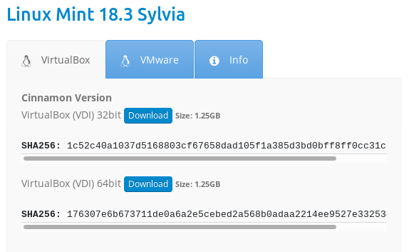

# Motivations

Si tu arrives sur cette page, c'est que tu as déjà une idée de ce que tu cherches.
Tu veux donc **apprendre à coder**. La question à te poser est **"Pourquoi veux-tu apprendre à coder ?"**. Cette question me parait fondamentale si tu ne veux pas être déçu(e).

Pardonne moi déjà le fait de te tutoyer, mais il me semble important que tu te sentes à l'aise, comme si tu parlais à un ami.

Revenons à la question initiale : que cherches-tu ? Et, attention, je vais commencer par les choses qui, à mon avis, ne devraient pas te plaire.

Tu ne trouveras donc pas ici :

* des informations pour coder en moins de 10h un clone de *Call Of Duty* en Python,
* un robot qui parle et qui répond à tes questions de manière intelligente,
* un programme capable de faire tes devoirs à ta place,
* de quoi pirater le logiciel de ton collège pour augmenter tes notes, ou changer les appréciations des profs.

Sur cette partie de mon site, tu trouveras de quoi t'initier à la programmation et que tu pourras appliquer quelque soit le langage de programmation et j'espère te donner l'envie d'aller encore plus loin dans ce domaine.

*Programmer, c'est créer, c'est adapter, c'est automatiser des tâches répétitives et longues.* C'est aussi imaginer des usages qui simplifient la vie ou qui te permettent de te détendre, de jouer.

Cette page que tu es en train de lire nécessite un ensemble impressionnant de technologies pour fonctionner que tu sous-estimes très certainement et j'essaierai, autant que faire se peut, de te donner les clés de ce monde parallèle.

Si tu es prêt à devenir un codeur, un artiste du clavier, que tu soies une fille ou un garçon, ce site est donc fait pour toi.

J'ai eu la chance de décrouvrir l'informatique et le développement de logiciel à ton âge, c'est à dire vers 10 ans. Je vais donc te présenter des concepts et des techniques qui te permettront de prendre goût à cet univers secret du *coding*.

Tu peux enlever ta capuche, allumer la lumière et ouvrir les volets : il n'y a que dans les films où les programmeurs codent dans le noir sur des écrans vert et noirs, affublés d'une capuche et de lunettes.

# Prépare ton environnement

Tu t'attends à trouver dans ce paragraphe un guide pour installer des logiciels et commencer à coder. Désolé de te décevoir, mais ce ne sera pas le cas, pas de tout de suite. Cela va arriver rapidement car je te sens impatient, cependant il me parait important d'évoquer ton cadre de travail.

## Organise de ton espace

Il te faudra un bureau agréable, une chaise confortable, un écran d'une taille acceptable. Bref plein de choses en "able". Je te conseille aussi une lumière indirecte, qui éclaire bien ton clavier mais qui n'est pas trop forte, afin de favoriser ta concentration.

En parlant de concentration, je te conseille d'avoir aussi un peu de place pour un bloc note papier, un stylo et un crayon de papier.

> Ouhhh le vieux avec son crayon et ses feuilles !

J'assume ! Il te faudra noter certains éléments pour mieux les retenirs ou même élaborer des petits dessins pour
t'aider à concevoir tes programmes. On a pas fait mieux que le crayon et le papier, en tout cas au stade de ton apprentissage.

Tu peux écouter un peu de musique, mais il faut qu'elle soit assez reposante et pas trop forte. Cela nuira à ta concentration. Ton cerveau ne sera pas mobilisé à 100% sur ce que tu es en train d'apprendre. D'ailleurs ces conseils valent aussi pour n'importe quel travail.

## Ton ordinateur

Si tu lis cette page, c'est que tu as au moins un smartphone, une tablette ou un ordinateur.

Même s'il est techniquement possible d'apprendre à coder directement sur un smartphone ou une tablette, je te
conseille d'utiliser un ordinateur, portable ou de bureau car sinon tu vas vite être en difficulté.

Le mieux est un ordinateur portable avec un écran supplémentaire, un clavier en plus et une souris, mais tu peux directement programmer sur un ordinateur portable. Tu peux aussi éventuellement acheter un Raspberry PI 3 et pour moins de 100 € tu auras un ordinateur dédié à la programmation.

## Un système d'exploitation

Généralement, l'ordinateur auquel tu as accès, grâce à tes parents, fonctionne sous Windows. On peut tout à fait
programmer sous Windows, fort heureusement. Pour ma part j'utilise Linux et particulièrement Linux Mint. Si cela t'intéresse j'évoquerai dans un paragraphe les différents systèmes d'exploitation existant.

Ce que je peux te conseiller, c'est de demander à un adulte si tu peux installer VirtualBox. Ce logiciel gratuit te permettra ensuite d'installer n'importe quel système d'exploitation et le simuler comme s'il s'agissait d'un véritable ordinateur. Tu seras alors complètement autonôme dans cet ordinateur virtuel, mais bien réél, sans risque d'endommager les fichiers de tes parents.

Avec cette solution, je te recommande quand même un ordinateur avec au moins 4 Go de RAM. Le mieux serait même 8 Go ou plus encore. Si tu ne vois pas de quoi je parle, ce n'est pas grave, demande à un adulte de vérifier la quantité de mémoire présente sur ton ordinateur. Attention, il ne s'agit pas de l'espace sur le disque dur, mais de la quantité de mémoire vive.

Et oui, programmer nécessite un système d'exploitation (*Operating System* en anglais). Même si tu ne connaitras tout ce que tu peux faire avec, développer un programme te fera passer de l'autre côté de la barrière. Tu ne seras un simple utilisateur du système, mais tu l'enrichiras.

## Installation de Linux Mint dans VirtualBox

Ces étapes ne sont que des recommandations, tu n'es pas obligé(e) d'installer `VirtualBox` et `Linux Mint`, mais ce serait mieux. Encore mieux, si tu es déjà sous Linux, à la place de Windows, ce sera d'autant plus facile.

Si tu as suivi mes recommandations du paragraphe précédent, te voici avec VirtualBox installé sur ton ordinateur.
Tu peux donc installer Linux Mint dedans. C'est assez simple car il existe des "images" pré-installées de Linux Mint pour Virtual Box.

Tu peux te rendre sur cette page [https://www.osboxes.org/linux-mint](https://www.osboxes.org/linux-mint) et
télécharger la version 64 bits de Linux Mint 18.3 Sylvia au format VirtualBox. Attention ce téléchargement peut être long en fonction de ta connection internet, il te faudra être patient.



Ensuite, décompresse le fichier ZIP dans ton répertoire personnel. Evite de le dézipper dans le répertoire "téléchargements" ou sur le bureau. Si tu ne sais pas comment faire, demande à un adulte. Il te faudra peut-être
télécharger un autre logiciel de décompression "7-Zip" car le format est un peu spécial.

Pour télécharger 7-Zip et l'installer sous Windows, rends toi sur ce site : [http://www.spiroo.be/7zip/](http://www.spiroo.be/7zip/)

Tu dois maintenant te retrouver avec un fichier `Linux Mint 18.3 Cinnamon (64bit).vdi`. Ce fichier contient
une machine virtuelle VirtualBox qu'il va falloir importer.

Je te rassure, tu vas être rapidement autonôme une fois ces étapes passées. 

Ouvre ensuite VirtualBox, clique sur le menu `Grouper` puis `Nouvelle machine`

>> Image

Tu vas obtenir cet écran où tu vas devoir saisir les bonnes informations.

>> Image

Tu peux maitenant lancer la machine virtuelle.

>> Image

Tu vas devoir suivre certaines indications car l'image virtuelle que tu as récupérée est paramétrée par défaut
en anglais. Tu vas la basculer en français, mais il te faudra bien appliquer les étapes que je vais te donner.

>> Image

Maintenant tu vas pouvoir même te créer un compte

>> Image

Ouvrir un "terminal", tu vas voir, tu vas taper ta première commande digne d'un codeur, et tape la ligne suivante (après le $).
Il va te demande le mot de passe de l'utilisateur `osboxes`. C'est toujours `osboxes.org`.

```
osboxes@osboxes ~ $ sudo adduser codeur sudo
[sudo] password for osboxes: 
Adding user `codeur' to group `sudo' ...
Adding user codeur to group sudo
Done.
```

Tu peux fermer le terminal.

Avec l'action que tu viens de faire, le nouvel utilisateur `codeur` pourra administrater facilement Linux grâce à une commande
qui s'appelle `sudo` qui signifie "**s**uper **u**ser **do**" ... en bon français bien de chez nous "Super utilisateur, fait ...".
Seul un "super utilisateur" peut faire certaines tâches sous Linux, notamment installer des logiciels de programmation.

Ferme la session courante et ouvre maintenant une nouvelle session avec l'utilisateur que tu viens de créer.

>> Image

Après toute ces manipulations, **je te félicite**. Si tu as réussi, tu as toutes les qualités requises pour apprendre à programmer :

* tu sais lire,
* tu sais suivre une documentation,
* tu sais manipuler VirtualBox,
* tu sais installer Linux Mint.
* tu sais ouvrir un terminal et saisir des commandes (on appelle cela des commandes `SHELL` ou encore des commande `BASH`)

On va pouvoir passer aux choses sérieuses.

# Définition : ordinateur

Si on prend la définition du Larousse, tu sais, le gros bouquin qui est dans la bibliothèque de tes parents, mais que tu ne consultes jamais parce que maintenant tu as Google et Wikipedia ... voire même YouTube.

Ordinateur :
> Machine automatique de traitement de l'information, obéissant à des programmes formés par des suites d'opérations arithmétiques et logiques.

Tout est là, et tout est clair. Un ordinateur c'est bête, voire très bête. Ca n'effectue que des tâches basiques, comme des opérations, des échanges de données avec des périphériques : clavier, souris, écran, wifi, disque dur, clé USB, etc.

Mais un ordinateur fait ces petites tâches répétitives tellement rapidement qu'en les imbriquant les unes les autres, en les appelant entre elles, bref en composant un programme, on arrive arrive à faire des grandes choses comme afficher une vidéo, écrire un site internet, commander des pizzas ...

Chez Google par exemple, tu accèdes avec ton navigateur à leur site. Ton navigateur est lui-même un programme qui est capable d'échanger des informations sur le réseau et donc sur internet. Quant à Google, ils ont pleins d'ordinateurs qui permettent de répondre à toutes les sollications de part le monde. Ces ordinateurs sont nombreux et puissants, mais ils fonctionnent tous de la même manière, ce sont des

> machines automatiques de traitement de l'information, obéissant à des programmes formés par des suites d'opérations arithmétiques et logiques.

Donc je vais t'apprendre à créer des suites d'opérations, c'est à dire des mini-tâches, qui vont constituer tes programmes.

# Définition : programme informatique

Nous y voilà ! Un programme informatique est simplement un ensemble de tâches successives qui aura pour but de fournir un résultat.

Il prendra des informations en entrée, comme des saisies au clavier, des fichiers sur le disque dur, des images d'une webcam.

Le programme va traiter ses informations et en fonction de ce qui est analysé, il va faire des choix très simple. Ce sont ces choix que tu vas coder. En gros, tu vas lui permettre de choisir entre tel et tel cas, mais ne t'attends à une intelligence. Comme je te l'ai déjà dit, un ordinateur c'est "idiot".

Enfin tu pourras répéter des tâches. C'est justement la force d'un programme par rapport à un humain : un programme ne se fatigue pas (normalement). Il n'a pas besoin de se reposer ni de manger. Il ne ralentit pas quand il est fatiqué. Il est donc capable de faire des milliards de fois les mêmes taĉhes. 

Par exemple, pendant que tu lisais ce paragraphe pendant 30 secondes, l'ordinateur a analysé environ 1800 fois ce qu'il devait afficher à l'écran ! C'est beaucoup, non ? Mais tu vois, il va continuer à le faire tant qu'il est allumé environ 60 fois par seconde ! C'est magique. En fonction des ordinateurs et de leur capacité, cela peut même être beaucoup plus.

## Un peu de détails : bits et octets

Pour écrire un programme il te faudra un langage, car un ordinateur ne comprend que des petites impulsions électriques :

* `0` : éteint
* `1` : allumé

On appelle cela le binaire qui signifie "deux chiffres" : 0 ou 1.

Un chiffre binaire est appelé en anglais "*bit*".

Donc un programme va manipuler des chiffres et des nombres binaires qui vont représenter des données, c'est à dire des nombres, des lettres, des phrases, de la musique, des vidéos, etc. Tout est binaire dans ordinateur.

En général, un ordinateur regroupe ces *bits* par paquet de 8 pour les manipulés. Un paquet de 8 bits est appelé `octet`. Tu en as sûrement déjà entendu parlé, car les clés USB, les débits internets, les tailles de carte SD sont exprimés avec cette unitée.

D'ailleurs même le programme que tu vas écrire dans un langage sera traduit en binaire pour être exécuté par l'ordinateur mais aussi pour pouvoir être sauvegarder sur ton disque dur ou sur une clé USB.

Ca parait simple dit comme cela, mais ça l'est. En plus tu vas utiliser un langage de haut niveau qui te permettra de rédiger et comprendre rapidement du code.

## Exemple : un programme

Je vais commencer par un exemple de programme dans un langage imaginaire, afin que tu voies à quoi ça ressemble.

Ce langage imaginaire n'est pas exécutable en l'état par une machine mais il suffirait de créer un traducteur vers son langage binaire pour qu'il puisse l'exécuter. Mais ce qui est *drôle*, c'est que ton cerveau, lui, il pourra l'exécuter !

```
Ligne 01 : effacer l'écran
Ligne 02 : afficher "Bonjour, comment t'appelles-tu ?"
Ligne 03 : attendre la réponse au clavier la mettre dans la variable PRENOM
Ligne 04 : afficher "Bonjour {PRENOM}, tu as un joli prénom !"
Ligne 05 : afficher "Veux-tu devenir mon ami(e) ?"
Ligne 06 : attendre la réponse au clavier la mettre dans la variable AMI
Ligne 07 : si AMI = OUI alors afficher "Super, je sens que l'on va bien s'entendre, {PRENOM} !"
Ligne 08 : sinon afficher "Dommage {PRENOM}, on aurait pu bien s'amuser."
```

Voilà, il s'agit d'un programme. Il détient beaucoup de concepts que je vais te décrire par la suite.

Comme je te l'ai déjà dit, malheureusement ce programme, écrit dans ce langage que je viens d'inventer, ne pourra pas s'exécuter sur un ordinateur si je ne dispose pas d'un traducteur.

Ces traducteurs, sont de deux grandes catégories :

* **Compilateurs** : le programme est traduit une bonne fois pour toute en langage binaire (ou langage machine), mais il sera transformé pour un type d'ordinateur et de système d'exploitation particulier. Par exemple il te sera impossible d'exécuter un programme compilé pour Linux sous Windows et vice et versa.

* **Interpréteurs** : ton programme restera toujours sous forme de texte comme ci-dessus, il ne sera pas traduit en une seule fois, mais c'est à chaque exécution de chaque ligne qu'un interpreteur cherchera à comprendre ce que ta ligne veut faire et exécutera les instructions binaires adaptés. L'avantage d'un programme interprété, c'est qu'il pourra s'éxécuter sous Windows alors que tu l'auras codé sous Linux. Il te faudra cependant un interpréteur pour chacun de ces systèmes d'exploitation. En règle générale, un interprétateur est plus lent qu'un programme compilé, mais il est portable.

Et tu verras qu'il existe même des techniques "Hybrides" de traduction à mi-chemin entre la compilation et l'interprétation.

Si on disposait d'un traducteur voici le résultat d'une des exécutions du programme :

```
Bonjour, comment t'appelles-tu ?
> Océane
Bonjour Océane, tu as un joli prénom !
Veux-tu devenir mon ami(e) ?
> OUI
Super, je sens que l'on va bien s'entendre, Océane !
```

Comme tu as pu le constater, il existe un autre "chemin" pour ce programme :

```
Bonjour, comment t'appelles-tu ?
> Océane
Bonjour Océane, tu as un joli prénom !
Veux-tu devenir mon ami(e) ?
> NON
Dommage Océane, on aurait pu bien s'amuser.
```

# Instructions et variables et mémoire

Si je reprends le code du paragraphe précédent, tu pourras y voir :

* des lignes qui contiennent des instructions :
  * `effacer`
  * `afficher`
  * `attendre la saisie`
* des variables, c'est à dire un endroit pour stocker de l'information : 
  * PRENOM
  * AMI
* une structure de contrôle `si ... alors ... sinon` qui permet de prendre plusieurs chemin en fonction de la valeur des variables testées.

> Le terme de "structure contrôle" est le terme exacte. Désolé, cela peut paraitre difficile à cerner, mais il en existe d'autres qui permettent, comme le "si ... alors ... sinon" de **contrôler** le déroulement de ton programme et de lui faire prendre des chemins, des directions différentes.

Tu peux déjà remarquer que les instructions sont des **verbes à l'infinitif** et que les variables sont des **noms communs**. Et oui, quand tu coderas il te vaudra mieux respecter des conventions. Cela te permettra de relire ton code plus tard et de le comprendre facilement, mais cela permettra aussi à d'autres personnes de reprendre ton code pour corriger des erreurs (des bugs) ou les améliorer.

Derrière les instructions de bases que je viens de te montrer, il s'exécutent en réalité une multitude d'autres petites instructions. Par exemple `afficher` qui permet donc d'afficher une phrase à l'écran effectue un travail considérable à ta place :

* elle parcourt chacune des lettres de la phrase.
* pour chacune des lettre trouvée, elle va écrire sur la carte vidéo de ton ordinateur tous les pixels (les points) qui composent la lettre, à l'endroit ou se situe le curseur.
* elle avance le curseur de la taille de lettre. Et oui le "i" est plus petit que le "B" en largeur.

Tu pourras, quand tu le souhaiteras, te plonger dans les détails techniques que je viens à peine de t'expliquer, mais tu n'en a pas besoin pour apprendre à programmer. Je te rassure aussi, ce que tu apprendras te permettra aussi de mieux comprendre les détails quand tu en auras besoin ou quand tu auras un bug à résoudre.

# Coder, c'est se tromper

Avant de bien coder, en tout cas j'espère que je code bien aujourd'hui, je me suis beacuoup trompé. J'ai fait beaucoup de programme avec plein de bugs dedans. J'ai fait des programmes lents qui consommaient beaucoup de mémoire ou qui n'étaient pas très optimisé. J'ai fait aussi beaucoup de programme que je n'arrivaient à comprendre quelques mois plus tard.

Faire des erreurs c'est normal, et tu en feras. Je te souhaite d'en faire, car c'est aussi comme cela que tu apprendras. On apprend toujours plus de ses échecs que de ses succès, surtout si tu arrives à comprendre pourquoi et si tu te corriges.

Toutefois, je vais t'aider à éviter quelques pièges et découvrir des astuces. Quand j'ai commencé à programmer, je n'avais pas internet : ça n'existait pas. J'avais quelques livres, pas forcément très clairs pour mon âge et j'avais aussi quelques copains passionnés comme moi. Je te souhaite de faire un peu le même chemin que moi, mais en accéléré. C'est le but de ce site : te donner les clés pour progresser rapidement.

Donc prépare toi à créer des bugs et à les résoudre ! Je te donnerai des exercices en ce sens. C'est à dire que je te fournirai du code avec des erreurs qu'il faudra que tu trouves et que tu corriges. Il n'y a pas plus formateur que ça !

# Ton premier programme réel qui fonctionne

J'ai décidé de te faire utiliser un langage professionnel très répandu et qui te permettra de tout faire par la suite, que ce soit un site web professionnel, un jeu vidéo, ou une application sur Android et que tu soies sous Linux ou Windows : **JAVA**.

Tu as beaucoup de chance, JAVA est un langage très facile. Il existe beaucoup d'outils pour t'aider à programmer. Il est aussi très puissant et possède plein de détails techniques très pointus. Mais il te permettra d'apprendre et surtout de t'ouvrir des perspectives de développement très larges.

Certains pourront penser qu'apprendre directement avec **JAVA** est trop compliqué et donc que c'est une erreur : tu vas voir, on va les faire mentir !

## Installation de Java

D'abord il va te falloir installer JAVA. Il existe plusieurs déclinaisons de la plateforme JAVA : dans notre cas il s'agit du compilateur et de tous les outils necessaires pour faire du JAVA. 

Si tu as bien suivi mes paragraphes précédents, je viens de dire **compilateur JAVA**. C'est à moitié vrai, à moitié faux. En fait la plateforme JAVA existe sous tout un tas de systèmes d'exploitation comme Linux ou Windows. Il te faut une **JAVA Virtual Machine** pour faire fonctionner un programme Java. Mais tu n'auras pas besoin de le recompiler quand tu passes d'un Windows à un Linux, un peu comme un langage interprété.

Java est donc une solution hybride à mi-chemin entre un langage compilé et interprété. Je pourrais rentrer dans de plus amples détails mais je pense que cela suffit pour le moment.

Si tu es sous windows, rends toi sur ce site et télécharge le JDK (Java Development Kit) et installe le.

Si tu es sous Linux Mint, comme je te l'ai conseillé, ouvre un terminal et tape la commande suivante, sans te tromper, bien évidemment `sudo apt install openjdk-10`

Pour vérifier que Java est bien installé, ouvre un nouveau terminal et tape la commande suivante : `java -version`

Voici ce que tu verras apparaitre dans ton terminal :

```

```


